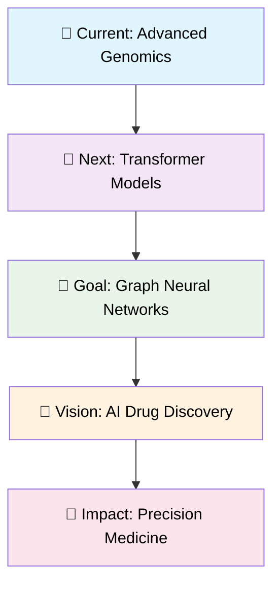

<div align="center">

<!-- Header Banner -->


# 🧬 **Jahnavi G Bedre** 🤖
### *AI Enthusiast × Bioinformatics Explorer*


<!-- Animated DNA Helix -->


<!-- Profile Stats Cards -->


</div>

---

## 🚀 **About Me** 


```python
class AIBioinformatician:
    def __init__(self):
        self.name = "Jahnavi G Bedre"
        self.education = "M.Sc. Bioinformatics @ REVA University (2026)"
        self.passion = ["AI", "Machine Learning", "Computational Biology"]
        self.current_focus = ["Drug Discovery AI", "Genomic ML", "Bio-AI"]
        self.motto = "Bridging AI and Life Sciences 🌉"
    
    def get_skills(self):
        return {
            "ai_ml": ["TensorFlow", "PyTorch", "Scikit-learn", "Keras"],
            "bioinformatics": ["BLAST", "Clustal", "NGS", "Phylogenetics"],
            "programming": ["Python", "R", "JavaScript", "SQL"],
            "specialization": "AI-driven biological solutions"
        }
    
    def life_goal(self):
        return "Revolutionize healthcare through AI × Biology! 🎯"
```

<br clear="right"/>

---

<div align="center">

## 🎯 **Focus Areas & Expertise**


</div>

<table align="center" width="100%">
<tr>
<td align="center" width="25%">
<br/>
<b>🤖 AI/ML in Biology</b><br/>
<sub>Deep Learning for<br/>Biological Systems</sub>
</td>
<td align="center" width="25%">
<br/>
<b>🧬 Computational Genomics</b><br/>
<sub>AI-Driven Genome<br/>Analysis & Interpretation</sub>
</td>
<td align="center" width="25%">
<br/>
<b>💊 AI Drug Discovery</b><br/>
<sub>ML Pipelines for<br/>Compound Prediction</sub>
</td>
<td align="center" width="25%">
<br/>
<b>📊 Biodata Analytics</b><br/>
<sub>Pattern Recognition in<br/>Biological Datasets</sub>
</td>
</tr>
</table>

---

<div align="center">

## 💻 **Tech Arsenal**


</div>

### 🤖 **AI/ML Stack**
<div align="center">


</div>

### 🧬 **Bioinformatics Toolkit**
<div align="center">


</div>

### 🛠️ **Development & Tools**
<div align="center">


</div>

---

<div align="center">

## 🧪 **Featured AI × Bio Projects**


</div>

<details>
<summary><b>🎯 AI-Driven Drug Discovery for HBV-HBx</b> &nbsp;</summary>

<br>

**🔬 Machine Learning Pipeline for Hepatitis B Treatment Discovery**


- 🤖 **ML Models**: Built predictive models for bioactive compounds against HBV-HBx protein
- 🧬 **Molecular Docking**: Implemented AI-optimized docking simulations 
- 📊 **Screening Pipeline**: Created automated high-throughput screening system
- 💡 **Innovation**: Combined deep learning with traditional computational chemistry

**Tech Stack:** `Python` `TensorFlow` `RDKit` `AutoDock` `Pandas` `Matplotlib`

<br clear="right"/>

</details>

<details>
<summary><b>📊 AI-Enhanced Genomic GC Content Analyzer</b> &nbsp;</summary>

<br>

**🧬 Intelligent Genome Composition Analysis Tool**


- 🎯 **Smart Analysis**: ML-powered GC content pattern recognition
- 🧠 **Clustering**: AI-driven identification of compositional regions
- 📈 **Visualization**: Interactive genomic insights dashboard
- 🔍 **Pattern Discovery**: Automated detection of genomic anomalies

**Tech Stack:** `Python` `Scikit-learn` `Matplotlib` `Seaborn` `BioPython`

<br clear="right"/>

</details>

<details>
<summary><b>🌐 BioResearch Collaboration Hub</b> &nbsp;</summary>

<br>

**💬 Real-time Platform for Computational Biology Teams**


- 🚀 **Real-time Chat**: Built with Flask + Socket.IO for instant communication
- 📁 **File Sharing**: Specialized for biological datasets and analysis results
- 🧬 **Bio-specific Features**: Discussion threads for genomics projects
- 🔒 **Secure**: Encrypted data handling for sensitive research data

**Tech Stack:** `Flask` `Socket.IO` `JavaScript` `MySQL` `Bootstrap`

<br clear="right"/>

</details>

<details>
<summary><b>🎮 Evolutionary AI Gaming Suite</b> &nbsp;</summary>

<br>

**🧠 Bio-Inspired Intelligent Game AI Systems**


- 🎯 **Deep Q-Learning**: Advanced Tic-Tac-Toe AI with neural networks
- ♟️ **Chess Intelligence**: Stockfish-powered strategic gameplay
- 🧬 **Genetic Algorithms**: Evolutionary strategy optimization
- 📊 **Performance Analytics**: Real-time learning curve visualization

**Tech Stack:** `Python` `TensorFlow` `Reinforcement Learning` `Stockfish` `Pygame`

<br clear="right"/>

</details>

---

<div align="center">

## 📊 **GitHub Analytics Dashboard**


<table width="100%">
<tr>
<td width="50%">

</td>
<td width="50%">

</td>
</tr>
</table>


<!-- Contribution Snake -->


</div>

---

<div align="center">

## 🏆 **Achievements & Certifications**


</div>

<table align="center" width="100%">
<tr>
<td align="center" width="50%">

### 🎓 **Academic Excellence**
  
  
  

</td>
<td align="center" width="50%">

### 🏅 **Workshops & Symposiums**
  
  
  

</td>
</tr>
</table>

---

<div align="center">

## 🌱 **Learning Journey & Future Goals**


</div>



### 📚 **Currently Learning:**
- 🧠 **Transformer Models** for protein sequence analysis
- 🔬 **Graph Neural Networks** for molecular property prediction
- 📊 **Multi-modal AI** for integrating different biological data types
- 🧬 **CRISPR-AI** for guide RNA design optimization

### 🎯 **2024-2025 Roadmap:**
- [ ] 🏆 Complete Advanced Deep Learning Specialization
- [ ] 📝 Publish research paper on AI in genomics
- [ ] 🤝 Contribute to major bioinformatics open-source project
- [ ] 💊 Develop end-to-end drug discovery AI pipeline
- [ ] 🌟 Mentor fellow AI + Bio enthusiasts

---

<div align="center">

## 🤝 **Let's Connect & Collaborate**


### **🚀 Ready to revolutionize life sciences with AI?**

<br>

<a href="mailto:bedrejahnavi2003@gmail.com">

</a>
<a href="https://linkedin.com/in/jahnavi-g-bedre-34653928b">

</a>
<a href="https://github.com/jahnavigbedre">

</a>

<br><br>

<!-- Visitor Counter -->


<br><br>

### 🌟 **"Decoding life's mysteries, one algorithm at a time!"** 🌟


</div>

---

<div align="center">

**⭐ Star my repositories if you find them interesting! ⭐**

<!-- Footer Banner -->


</div>
