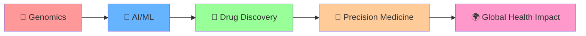

<div align="center">
  
# ✨ Welcome to My World of Bioinformatics & AI ✨
  


</div>

---

## 🧬 About Me


```python
class BioinformaticistAI:
    def __init__(self):
        self.name = "Jahnavi G Bedre"
        self.role = "M.Sc. Bioinformatics Student"
        self.university = "REVA University (2026)"
        self.passion = ["Computational Biology", "Genomics", 
                       "AI in Drug Discovery", "Multi-Omics"]
        self.motto = "Turn data into discoveries"
        
    def current_focus(self):
        return {
            "🧬": "AI-Driven Drug Discovery",
            "🤖": "Machine Learning in Biology",
            "📊": "Genomic Data Analysis",
            "🔬": "Computational Research"
        }
```

<div align="center">

### 🌟 *"At the intersection of biology and technology, I build bridges between the microscopic and the digital world"* 🌟

</div>

---

## 🛠️ My Tech Arsenal

<div align="center">

### 💻 Programming & Development

<br>


### 🧬 Bioinformatics & Computational Biology
<p>
  
  
  
  
</p>

### 🤖 AI & Machine Learning

<br>


### 🗄️ Tools & Platforms


</div>

---

## 🚀 Featured Projects

<div align="center">
<table>
<tr>
<td width="50%">

### 🧬 AI-Driven Drug Discovery (HBV-HBx)


**Building ML pipelines to revolutionize drug discovery**
- 🎯 Compound prediction algorithms
- 🧪 Target identification systems
- 📊 Bioactivity analysis
- ⚡ High-throughput screening

</td>
<td width="50%">

### 📊 GC Content Analyzer


**Python-powered genomic analysis tool**
- 🧬 Genome composition analysis
- 📈 Interactive visualizations
- 🔍 Pattern recognition
- 💾 Batch processing capabilities

</td>
</tr>
<tr>
<td width="50%">

### 🌐 Research Collaboration Hub


**Real-time research communication platform**
- 💬 Flask + Socket.IO backend
- 🔄 Live collaboration features
- 📝 Research note sharing
- 🔐 Secure data handling

</td>
<td width="50%">

### 🎮 AI Gaming Suite


**Intelligent game AI systems**
- 🎯 Tic-Tac-Toe with DQN & Minimax
- ♟️ Chess Bot powered by Stockfish
- 🧠 Reinforcement Learning models
- 🎮 Interactive gameplay interfaces

</td>
</tr>
</table>
</div>

---

## 🏆 Achievements & Recognition

<div align="center">

 **Certifications & Learning** 

</div>

<table align="center">
<tr>
<td align="center" width="25%">

</td>
<td align="center" width="25%">

</td>
<td align="center" width="25%">

</td>
<td align="center" width="25%">

</td>
</tr>
</table>

---

## 📊 GitHub Analytics

<div align="center">
  


</div>

---

## 🌟 Current Learning Path

<div align="center">


```mermaid
graph LR
    A[🧬 Genomics] --> B[🤖 AI/ML]
    B --> C[💊 Drug Discovery]
    C --> D[🔬 Precision Medicine]
    D --> E[🌍 Global Health Impact]
    
    style A fill:#ff9999
    style B fill:#66b3ff
    style C fill:#99ff99
    style D fill:#ffcc99
    style E fill:#ff99cc
```

</div>

---

## 🤝 Let's Connect & Collaborate

<div align="center">


### 💌 Ready to discuss bioinformatics, AI, or exciting collaborations?

<p>
<a href="mailto:bedrejahnavi2003@gmail.com">
  
</a>
<a href="https://linkedin.com/in/jahnavi-g-bedre-34653928b">
  
</a>
<a href="https://github.com/jahnavigbedre">
  
</a>
</p>


### 🌟 *"Together, we can decode the future of life sciences!"* 🌟

</div>

---

<div align="center">


<h3>⭐ Don't forget to star repositories you find interesting! ⭐</h3>


</div>
